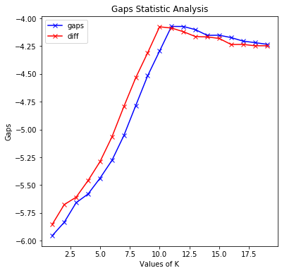

# OptimalCluster

[](https://pepy.tech/project/optimalcluster)
(From [PePy](https://pepy.tech/project/OptimalCluster))

Check out https://shreyas-bk.github.io/OptimalCluster/

Pip package: https://pypi.org/project/optimalcluster

OptimalCluster is the Python implementation of various algorithms to find the optimal number of clusters. The algorithms include elbow, elbow-k_factor, silhouette, gap statistics, gap statistics with standard error, and gap statistics without log. Various types of visualizations are also supported.

For references about the different algorithms visit the following sites:

elbow : [Elbow Method](https://en.wikipedia.org/wiki/Elbow_method_(clustering).)

elbow_kf : _my own implementation, details to be added soon_

silhouette : [Silhouette Score](https://scikit-learn.org/stable/modules/generated/sklearn.metrics.silhouette_score.html)

gap_stat : [Paper](http://www.web.stanford.edu/~hastie/Papers/gap.pdf)  |  [Python](https://anaconda.org/milesgranger/gap-statistic/notebook)

gap_stat_wolog : [Paper](https://core.ac.uk/reader/12172514)

# Installation

To install the OptimalCluster package through the Python Package index (PyPI) run the following command:
```
pip install OptimalCluster
```

## Documentation

Visit this link : [Documentation](https://github.com/shreyas-bk/OptimalCluster/blob/master/Documentation.md)

## Example

Visit this link for interactive colab demo : [Example](https://colab.research.google.com/github/shreyas-bk/OptimalClusterExampleNB/blob/master/Example.ipynb)

```python
from OptimalCluster.opticlust import Optimal
opt = Optimal({'max_iter':350})
```


```python
import pandas as pd
from sklearn.datasets.samples_generator import make_blobs
import matplotlib.pyplot as plt
plt.rcParams['figure.figsize'] = 6, 6
x, y = make_blobs(1000, n_features=2, centers=3)
plt.scatter(x[:, 0], x[:, 1])
plt.show()
df = pd.DataFrame(x,columns=['A','B'])
```
    


```python
opt.elbow(df)
```

    Optimal number of clusters is:  3 
    3


```python
opt.elbow(df,display=True,visualize=True)
```


    Optimal number of clusters is:  3 
    3


```python
x, y = make_blobs(1000, n_features=2, centers=5)
plt.scatter(x[:, 0], x[:, 1])
plt.show()
df = pd.DataFrame(x,columns=['A','B'])
```


```python
opt.elbow(df,display=True,visualize=True,method='lin',sq_er=0.5)
```


    Optimal number of clusters is:  5 
    5


```python
x, y = make_blobs(1000, n_features=3, centers=8)
plt.scatter(x[:, 0], x[:, 1])
plt.show()
df = pd.DataFrame(x,columns=['A','B','C'])
```


```python
opt.elbow_kf(df,display=True,visualize=True)
```


    Optimal number of clusters is:  7  with k_factor: 0.29 . Lesser k_factor may be due to overlapping clusters, try increasing the se_weight parameter to 2.0
    7


```python
opt.elbow_kf(df,se_weight=2.5)
```

    Optimal number of clusters is:  8  with k_factor: 0.88 . 
    8


```python
opt.elbow_kf(df,se_weight=3)
```

    Optimal number of clusters is:  8  with k_factor: 0.88 . 
    8


```python
opt.elbow_kf(df,se_weight=3.5)
```

    Optimal number of clusters is:  8  with k_factor: 1.0 . 
    8


```python
x, y = make_blobs(1000, n_features=2, centers=10)
plt.scatter(x[:, 0], x[:, 1])
plt.show()
df = pd.DataFrame(x,columns=['A','B'])
```


```python
opt.gap_stat(df,display=True,visualize=True)
```

    


    10


```python
x, y = make_blobs(1000, n_features=3, centers=12)
df = pd.DataFrame(x,columns=['A','B','C'])
```


```python
opt.gap_stat_se(df,display=True,visualize=True,upper=20)
```
    





    11


```python
from sklearn.datasets import load_iris
import numpy as np
import pandas as pd
iris = load_iris()
df = pd.DataFrame(data= np.c_[iris['data'], iris['target']],
                     columns= iris['feature_names'] + ['target'])
opt.gap_stat_wolog(df[['petal width (cm)']],display=True,visualize=True)
```

    


    3


_Contributions are welcome, please raise a PR_

# TODO

 - add increment_step param to elbow_kf with default as 0.5
 - New verbose parameter addition for methods
 - Needs checks for upper and lower parameters
